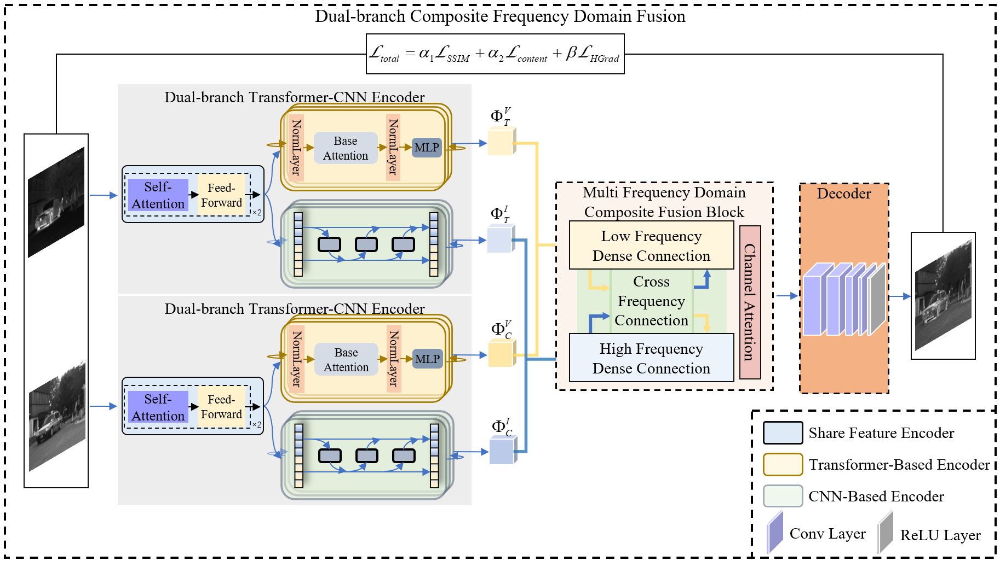

# DCFDFuse: A multi-scale image fusion method based on the composite fusion of high-low frequency dual branches.

## abstract
Multi-modal image fusion aims to combine the strengths of different modalities to create images rich in detail and functionality. However, the complexity of cross-modal feature fusion and the challenges related to the efficient training of fusion networks are significant issues in this field. To address these problems, we propose a novel Dual-branch Composite Frequency Domain fusion network (DCFDFuse). The network first utilizes a shared feature encoder to capture shallow features across modalities. And then, employs a dual-branch Transformer-CNN architecture to separately extract low-frequency features and high-frequency details. We design a Multi-frequency Domain Composite Fusion Block to effectively integrate the frequency domain information. Additionally, a Hybrid Gradient Loss function is introduced, which preserves low-frequency features while enhancing high-frequency characteristics. Extensive experiments demonstrate that DCFDFuse achieves remarkable performance in infrared-visible image fusion, showcasing its significant potential for practical applications.
## Project Structure
```plaintext
|-- core
|   |-- block.py
|   |-- dataset.py
|   |-- high_extractor.py
|   |-- loss.py
|   |-- low_extractor.py
|   |-- net.py
|-- fig
|-- log
|-- models
|   |-- model_loss_group_epoch100.pth
|-- test_log
|-- tools
|   |-- evaluator.py
|   |-- utils.py
|-- config.py
|-- README.md
|-- test.py
|-- train.py
|-- requirements.txt
```
**explain**：
- **core**:
  - Core Function Code：
      - **block.py**:Blocks that may be used in the network
      - **dataset.py**:Dataset processing code
      - **high_extractor.py**:High-frequency processing network module
      - **loss.py**:Loss function module
      - **low_extractor.py**:Low-frequency processing network module
      - **net.py**:Network module
- **fig**:
  - The architecture of our DCFDFuse network
- **log**：
    - Save the trained model file. After the training is completed, the model will be saved in this directory for subsequent testing and use
- **models**：
    - The model in the article
- **test_log**：
    - Test result storage location
- **tools**：
    - Tool modules that may be used in the project:
        - **evaluator.py**：Evaluation metrics calculation code
        - **utils.py**：Utils code
- **config.py**：
    - Configuration file
- **test.py**：
    - test file
- **train.py**：
    - train file
- **requirements.txt**：
    - List the Python libraries required by the project and their versions. You can install them quickly using `pip install -r requirements.txt` .

## Instructions for Use
### train
Enter the main directory and use the following command to start the training:
```bash
python train.py
```
### test
After the training is completed, use the following command for testing:
```bash
python test.py
```